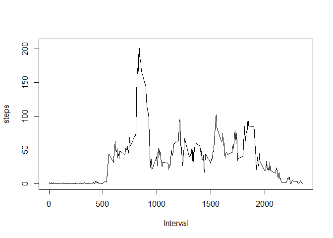
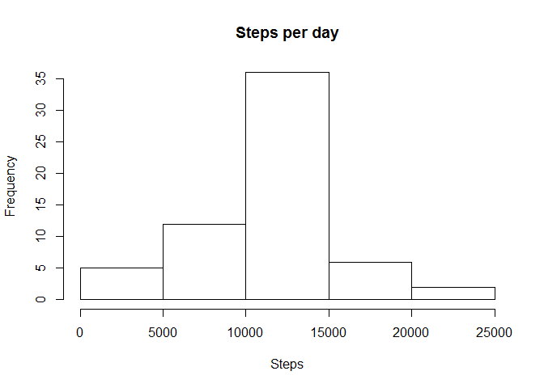
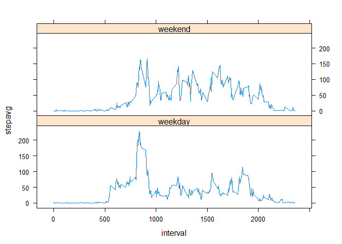

# Reproducible Research: Peer Assessment 1


## Loading and preprocessing the data

```r
setwd("C:\\Users\\calej\\Documents\\GitHub\\RepData_PeerAssessment1")
act<-read.csv("activity\\activity.csv")
act<-na.omit(act)

aggdate<-aggregate(act$steps,list(act$date),FUN=sum)

names(aggdate)<-c("date","steps")
agginterval<-aggregate(act$steps,list(act$interval),FUN=mean)
```

## What is mean total number of steps taken per day?

```r
##histogram of the total number of steps taken each day
hist(aggdate$steps,xlab="Steps",main="Steps per day")
```

\

```r
##Calculate and report the mean and median total number of steps taken per day
mean(aggdate$steps,na.rm=TRUE)
```

```
## [1] 10766.19
```

```r
median(aggdate$steps,na.rm=TRUE)
```

```
## [1] 10765
```

## What is the average daily activity pattern?

```r
##average number of steps taken, averaged across all days 
agginterval<-aggregate(act$steps,list(act$interval),FUN=mean)
plot(agginterval,type="l",xlab='Interval',ylab="steps")
```

\

```r
##Show 5-minute interval, on average across all the days in the dataset, which contains the maximum number of steps
agginterval[agginterval$x==max(agginterval$x),1]
```

```
## [1] 835
```


## Imputing missing values

```r
## reload data to include missing values
act<-read.csv("activity\\activity.csv")

##report the total number of missing values in the dataset
sum(is.na(act))
```

```
## [1] 2304
```

```r
##Fill in all of the missing values in the dataset with step average for missing interval
names(agginterval)<-c("interval","stepavg")
act<-merge(act,agginterval,by=c("interval"))
act$steps[is.na(act$steps)] <- act$stepavg[is.na(act$steps)]

##Create a new dataset that is equal to the original dataset but with the missing data filled in
aggdate2<-aggregate(act$steps,list(act$date),FUN=sum)
names(aggdate2)<-c("date","steps")

##histogram of the total number of steps taken each day 
hist(aggdate2$steps,xlab="Steps",main="Steps per day")
```

\

```r
##Calculate and report the mean and median total number of steps taken per day
mean(aggdate2$steps)
```

```
## [1] 10766.19
```

```r
median(aggdate2$steps)
```

```
## [1] 10766.19
```

## Are there differences in activity patterns between weekdays and weekends?

```r
##Create a new factor variable in the dataset with two levels -- "weekday" and "weekend" indicating whether a given date is a weekday or weekend day
act$date <- as.Date(act$date)
weekdays1 <- c('Monday', 'Tuesday', 'Wednesday', 'Thursday', 'Friday')
act$weekday <- c('weekend', 'weekday')[(weekdays(act$date) %in% weekdays1)+1L]
aggweekday<-aggregate(act$steps,list(act$interval,act$weekday),FUN=mean)
names(aggweekday)<-c("interval","weekday","stepavg")

##Make a panel plot containing a time series plot (i.e. type = "l") of the 5-minute interval (x-axis) and the average number of steps taken, averaged across all weekday days or weekend days (y-axis).

library("lattice")
xyplot(stepavg ~ interval | weekday, data=aggweekday,type="l",layout=c(1,2))
```

\
